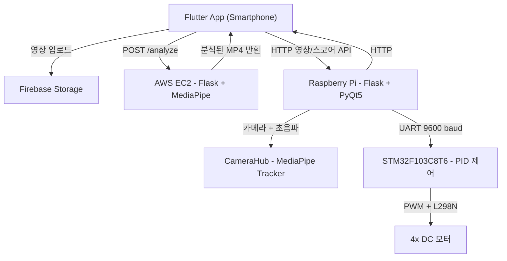

# 🏌️ CoolRo — 스마트 골프 캐디 로봇

> **대진대학교 휴먼IT공과대학 휴먼로봇융합전공 학사학위 논문 (2024.11)**
> 저자: 김성수, 남상기, 한준희 · 지도교수: 이관형

골프 플레이어를 자율 추종하며, AI 기반 스윙 자세 분석과 실시간 피드백을 제공하는 4륜 캐디 로봇 시스템입니다.

---

## 시스템 개요

CoolRo는 **엣지 인식(Raspberry Pi)**, **임베디드 모터 제어(STM32)**, **클라우드 자세 분석(AWS EC2)**, **모바일 앱(Flutter)** 을 하나의 파이프라인으로 통합한 프로젝트입니다.

### 핵심 기능
| 기능 | 설명 |
|------|------|
| **자율 추종 주행** | MediaPipe Pose Detection으로 사용자 위치를 실시간 탐지하고, HC-SR04 초음파 센서로 거리를 측정하여 일정 간격을 유지하며 따라감 |
| **골프 스윙 자동 녹화** | 골프 준비 자세(무릎 150°↑, 힙 160°↓)를 인식하면 녹화 시작, 스윙(손목이 힙보다 15% 이상 위) 감지 후 3초 뒤 녹화 종료 |
| **AI 자세 분석** | AWS EC2에서 MediaPipe로 영상을 프레임 단위 분석, 팔꿈치·무릎·척추 각도를 측정하여 교정 피드백 오버레이 영상 반환 |
| **스코어 관리** | 18홀 스코어·파 입력 및 자동 합산, 라즈베리파이 로컬 서버와 Flutter 앱 간 HTTP 동기화 |
| **영상 클라우드 저장** | 녹화 영상을 Firebase Storage에 업로드, 앱에서 재생·분석·삭제 관리 |
| **날씨 정보** | OpenWeatherMap API를 통해 현재 위치의 실시간 기상 데이터 제공 |
| **사용자 인증** | Firebase Authentication 기반 이메일/비밀번호 로그인·회원가입 |

---

## 아키텍처



---

## 하드웨어 구성

| 구성요소 | 사양 |
|----------|------|
| **메인 컴퓨터** | Raspberry Pi (64-bit Quad-core Cortex-A72) |
| **MCU** | STM32F103C8T6 (ARM Cortex-M3) |
| **모터 드라이버** | L298N H-Bridge |
| **모터** | 4× DC 모터 (4륜 구동) |
| **배터리** | 22.2V 리튬 폴리머 |
| **거리 센서** | HC-SR04 초음파 센서 (GPIO 23/24) |
| **카메라** | 라즈베리파이 카메라 모듈 |
| **외형** | Fusion 360으로 설계한 3층 구조 프레임 + 골프백 지지대 |

---

## 소프트웨어 스택

### Raspberry Pi (`raspberrypi/`)
| 모듈 | 역할 |
|------|------|
| `src/tracker.py` | MediaPipe Pose 추적, 픽셀 오차(error) + 동작 모드(mode) 계산 후 STM32로 전송 |
| `src/sensor.py` | HC-SR04 초음파 거리 측정 + 중앙값 필터 (슬라이딩 윈도우) |
| `src/transport.py` | pyserial로 UART 4바이트 오차 패킷 송신 (`/dev/ttyS0`, 9600 baud) |
| `src/state.py` | 스레드 간 거리 값 공유 (Lock 기반) |
| `src/loops.py` | 센서 루프 + 카메라 루프 (별도 스레드) |
| `local_app/camera_hub.py` | PyQt5 QThread 기반 카메라 스트리밍, 골프 준비/스윙 자세 인식, 자동 녹화 |
| `local_app/ui.py` | PyQt5 GUI: 카메라 뷰, 18홀 스코어 입력, 영상 재생/저장, 점수 전송 |
| `local_app/api_server.py` | Flask 로컬 HTTP 서버 (영상 업로드/목록/재생, 스코어 저장) |
| `local_app/robot_control.py` | RobotController: 센서/트래커/UART를 통합 관리 |

### STM32 펌웨어 (`stm32_f103_hal/`)
| 항목 | 사양 |
|------|------|
| **UART** | USART1 (PA9/PA10), 9600 baud, 8N1, 인터럽트 수신 |
| **PWM** | TIM2 CH1/CH2 (PA0/PA1), Prescaler=71, Period=999 → 1kHz |
| **모터 방향** | L298N IN1~IN4 (PB12~PB15), GPIO Push-Pull |
| **PID 제어** | Kp=3.0, Ki=0.5, Kd=1.5, 100Hz 루프, anti-windup ±500 |
| **기준 속도** | base_speed=800, PWM 범위 0~1000 |

### EC2 분석 서버 (`ec2_golf_server/`)
- **프레임워크**: Flask (포트 5000)
- **AI 엔진**: MediaPipe Pose (`model_complexity=1`, `min_detection_confidence=0.5`)
- **분석 항목**: 팔꿈치 각도, 무릎 각도, 척추 각도
- **임계값**: 팔꿈치 < 155° → "팔을 더 편하게", 무릎 < 155° → "무릎 안정", 척추 < 160° → "상체 세우기"
- **의존성**: Flask 3.0.3, MediaPipe 0.10.14, OpenCV 4.9.0.80, NumPy 1.26.4

### Flutter 앱 (`flutter_app/`)
- **프레임워크**: Flutter (Dart SDK ≥3.3.3)
- **상태관리**: GetX
- **인증**: Firebase Auth (이메일/비밀번호)
- **데이터**: Cloud Firestore, Firebase Storage
- **화면 구성**: Splash → Login → Home, LeaderBoard, Videocam, Replay, Profile, Weather, Settings
- **영상 분석 흐름**: Firebase Storage → 다운로드 → EC2 `POST /analyze` 전송 → 분석 MP4 수신 → 재생
- **날씨**: Geolocator + OpenWeatherMap API

---

## UART 패킷 프로토콜

```
Raspberry Pi → STM32 (4 bytes)

┌──────────┬──────────────┬──────────────┬──────────────┐
│ Byte 0   │ Byte 1       │ Byte 2       │ Byte 3       │
├──────────┼──────────────┼──────────────┼──────────────┤
│ 0xAA     │ error_hi     │ error_lo     │ mode         │
│ (헤더)    │ (signed 16b  │  high/low)   │ 0=정지       │
│          │              │              │ 1=추종       │
└──────────┴──────────────┴──────────────┴──────────────┘

error: person_x - frame_center (signed 16-bit, 픽셀)
  양수 = 사람이 오른쪽, 음수 = 사람이 왼쪽
mode: 0=정지(가까움/미감지), 1=추종(거리 > threshold)
```

## PID 조향 제어 (STM32 펌웨어)

PID 제어 루프는 **STM32에서 100Hz**로 실행됩니다.
RPi는 비전 처리 결과(오차+모드)만 전송하고, 실시간 모터 제어는 MCU가 담당합니다.

```
[RPi] MediaPipe → error 계산 → UART 전송
                                    ↓
[STM32] 패킷 수신 → PID 루프 (100Hz)
  P항: Kp(3.0) × error        → 즉시 보정
  I항: Ki(0.5) × ∫error·dt    → 경사/드리프트 누적 보정 (anti-windup ±500)
  D항: Kd(1.5) × d(error)/dt  → 오버슈트 방지
  → correction = P + I + D
  → left_pwm  = 800 + correction
  → right_pwm = 800 - correction
  → 음수 PWM → 해당 모터 역방향 (급조향)
  → mode=0 → 양쪽 정지 + PID 리셋
```

---

## EC2 분석 API

| 엔드포인트 | 메서드 | 설명 |
|-----------|--------|------|
| `/analyze` | POST | Multipart `video` 파일 전송 → MediaPipe 포즈 오버레이된 MP4 반환 |
| `/health` | GET | 서버 상태 확인 (`{"status": "ok"}`) |
| `/api/upload-video` | GET/POST | 영상 목록 조회 / 영상 업로드 |
| `/api/submit-score` | GET/POST | 스코어 데이터 조회 / 스코어 저장 |
| `/video/<filename>` | GET | 저장된 영상 스트리밍 |

---

## 설정 파라미터

### RPi 설정 — `raspberrypi/test/config.yaml`

| 파라미터 | 기본값 | 설명 |
|---------|--------|------|
| `trig_pin` | 23 | 초음파 Trigger GPIO 핀 |
| `echo_pin` | 24 | 초음파 Echo GPIO 핀 |
| `serial_port` | `/dev/ttyS0` | UART 시리얼 포트 |
| `baudrate` | 9600 | UART 통신 속도 |
| `distance_threshold_cm` | 50.0 | 전진/정지 전환 거리 (cm) |
| `center_tolerance_px` | 50 | PID 데드존 여유값 (px) |
| `sensor_interval_s` | 0.1 | 초음파 측정 주기 (초) |
| `message_interval_s` | 1.0 | UART 송신 주기 (초) |
| `echo_timeout_s` | 0.03 | 초음파 에코 타임아웃 (초) |
| `clahe_clip_limit` | 2.0 | CLAHE 클리핑 리밋 (야외 대비 보정) |
| `clahe_grid_size` | 8 | CLAHE 타일 그리드 크기 |
| `distance_filter_size` | 5 | 초음파 중앙값 필터 윈도우 크기 |

### STM32 PID 게인 — `main.c` (펌웨어 컴파일)

| 상수 | 값 | 설명 |
|------|-----|------|
| `PID_KP` | 3.0 | 비례 이득 — 즉시 보정 |
| `PID_KI` | 0.5 | 적분 이득 — 경사/드리프트 보정 |
| `PID_KD` | 1.5 | 미분 이득 — 오버슈트 방지 |
| `PID_BASE_SPEED` | 800 | 기준 모터 속도 (0~1000) |
| `PID_DT` | 0.01 | 제어 루프 주기 (10ms = 100Hz) |

---

## 야외 환경 강건성 (Outdoor Robustness)

실제 골프장에서 테스트 중 발견된 3가지 문제를 코드로 해결하였습니다.

### 1. 카메라 인식 안정화 — OpenCV 전처리 필터

**문제**: 야외 역광·그림자·급격한 조명 변화로 MediaPipe 포즈 인식 실패율 증가

**해결** (`tracker.py` → `_preprocess_frame()`):

```
원본 프레임 → BGR→YUV 변환 → Y 채널 CLAHE 적용 → YUV→BGR 변환 → GaussianBlur(5×5)
```

- **CLAHE**: Y 채널에 적응형 히스토그램 균일화 → 역광/그림자 대비 보정
- **GaussianBlur**: 5×5 커널 → 노이즈·모션 블러 완화

### 2. 초음파 센서 노이즈 제거 — 중앙값 필터

**문제**: 잔디·경사면에서 초음파 반사 각도가 불규칙하여 거리 측정값이 튀는 현상

**해결** (`sensor.py` → 슬라이딩 윈도우 중앙값 필터):

```
측정값 버퍼 (최근 5회) → None 제외 → 정렬 → 중앙값 반환
```

### 3. 울퉁불퉁 지형 조향 보정 — STM32 PID 제어

**문제**: 잔디·경사면에서 이산적 좌/우 명령 방식으로는 조향이 부정확하고, 경사면에서 속도 이상 발생

**해결 — STM32 임베디드 PID** (`main.c`에서 100Hz 실시간 루프):

RPi는 비전 처리만 담당하고, PID 제어 루프는 **결정론적 타이밍이 보장되는 STM32 MCU**에서 실행합니다.

```
[RPi] error 전송 (UART) → [STM32] PID 루프 (100Hz)
  Kp=3.0  → 피드백 즉시 반응
  Ki=0.5  → 경사/바람 등 지속적 외란 보상
  Kd=1.5  → 진동·오버슈트 억제
  → 음수 PWM → 역방향 회전 (급조향)
```

PID를 MCU에 배치한 이유:
- **결정론적 타이밍**: STM32는 OS 없이 10ms 주기를 정확하게 보장, RPi는 리눅스 스케줄링으로 jitter 발생
- **빠른 응답**: 센서→판단→모터 경로가 MCU 내부에서 완결, UART 지연 영향 최소화
- **안정성**: 통신 끊겨도 마지막 수신 값으로 PID가 계속 동작, mode=0 수신 시 안전 정지

---

## 빌드 & 실행

### 라즈베리파이 — 추적 단독 실행
```bash
cd raspberrypi/test
python3 main.py
```

### 라즈베리파이 — UI + 로컬 HTTP 서버
```bash
cd raspberrypi/test
python3 main_ui.py
```

### 라즈베리파이 — 통합 실행 (UI + 서버 + 추적 + UART)
```bash
cd raspberrypi/test
python3 main_full.py
```

### EC2 분석 서버
```bash
cd ec2_golf_server
pip install -r requirements.txt
python app.py
```

### STM32 펌웨어
- `stm32_f103_hal/main.c` → STM32CubeIDE/Keil에서 빌드 후 플래싱
- USART1: PA9(TX)/PA10(RX), 9600 baud
- PWM: TIM2 CH1(PA0)/CH2(PA1)
- L298N: IN1(PB12), IN2(PB13), IN3(PB14), IN4(PB15)

### Flutter 앱
```bash
cd flutter_app
flutter pub get
flutter run
```

---

## 디렉토리 구조

```
coolro/
├── raspberrypi/test/
│   ├── main.py              # 추적 단독 실행
│   ├── main_ui.py            # UI + 로컬 서버
│   ├── main_full.py          # 통합 실행
│   ├── config.yaml           # 센서/통신 설정
│   ├── test5.ui              # PyQt5 UI 정의
│   ├── src/
│   │   ├── config.py         # YAML 설정 로더
│   │   ├── tracker.py        # MediaPipe 포즈 추적 + 오차/모드 계산
│   │   ├── sensor.py         # HC-SR04 초음파 거리 측정 + 중앙값 필터
│   │   ├── transport.py      # UART 오차 패킷 송신 (error+mode)
│   │   ├── state.py          # 스레드 간 상태 공유
│   │   └── loops.py          # 센서/카메라 루프
│   └── local_app/
│       ├── camera_hub.py     # 카메라 스트리밍 + 골프 동작 인식 + 자동 녹화
│       ├── ui.py             # PyQt5 GUI (스코어/영상/카메라)
│       ├── api_server.py     # Flask 로컬 HTTP API
│       ├── robot_control.py  # 센서+트래커+UART 통합 제어
│       ├── config.py         # 경로/포트 설정
│       └── utils.py          # AVI→MP4 변환, 파일 유틸
├── stm32_f103_hal/
│   ├── main.c                # STM32 PID 펌웨어 (PID+UART+PWM+GPIO)
│   └── cubemx/               # STM32CubeMX 프로젝트
├── ec2_golf_server/
│   ├── app.py                # Flask 서버 (MediaPipe 자세 분석)
│   └── requirements.txt      # Python 의존성
└── flutter_app/
    └── lib/
        ├── main.dart                 # 앱 진입점 (GetMaterialApp, 라우팅)
        ├── screens/
        │   ├── intro_screen.dart     # 홈 화면
        │   ├── videocam_screen.dart  # 로컬 영상 재생 + Firebase 업로드
        │   ├── replay_screen.dart    # Firebase 영상 재생/분석/삭제
        │   ├── leaderboard_screen.dart # 스코어 리더보드
        │   └── profile_screen.dart   # 프로필 관리
        ├── weather/                  # OpenWeatherMap 날씨
        ├── login/                    # 로그인/회원가입
        └── service/auth_handler.dart # Firebase Auth 처리
```

---

## 참고문헌

논문에서 인용한 주요 참고:

1. Park, J. et al. (2019). "딥러닝과 센서 융합을 통한 자율 주행 로봇의 사용자 추종 및 장애물 회피 성능 향상." 한국컴퓨터정보학회 논문지
2. Kim, Y. et al. (2021). "Google MediaPipe를 활용한 스포츠 자세 분석: 골프 스윙을 중심으로." 스포츠과학연구
3. Patel, R. et al. (2020). "Cloud-based Real-Time Feedback System for Sports Training." IJAC
4. [MediaPipe Documentation](https://mediapipe.dev)
5. [OpenCV Python Tutorials](https://opencv.org)
6. [OpenWeatherMap API](https://openweathermap.org)

---

## 라이선스

학술 연구 프로젝트 — 대진대학교 휴먼IT공과대학 (2024)
