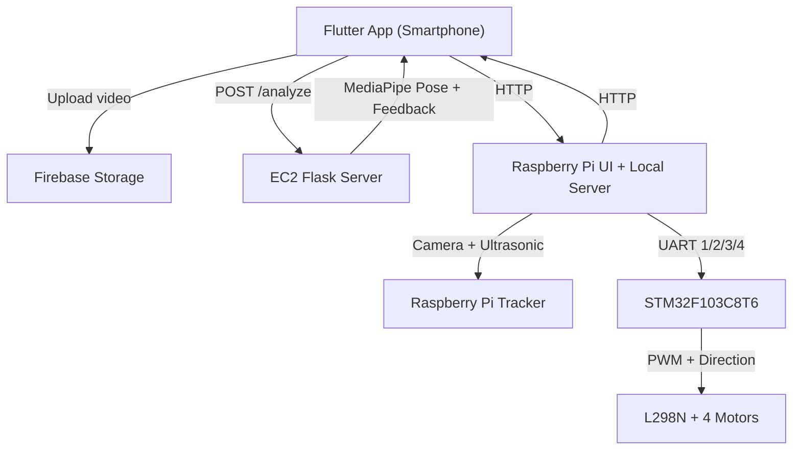

coolro-vision-robot-golf-system

* Real-time person tracking on Raspberry Pi that drives a 4-wheel robot via STM32 UART commands.
* Flutter app for video capture/replay + cloud storage, paired with EC2 posture analysis using MediaPipe.
* End-to-end pipeline covering edge sensing, embedded control, and cloud-based video feedback.

Demo
TODO: Add a GIF or short video link showing tracking and posture feedback end-to-end.

## Problem / Goal
I wanted a single system that links edge perception, embedded motor control, and cloud video analysis.
The goal was to move beyond isolated demos by connecting real-time tracking with feedback loops and a user-facing app.

## System Architecture


## Data Flow / API Flow
Raspberry Pi -> STM32 (UART)
- Command bytes: `1` left, `2` right, `3` forward, `4` stop

Raspberry Pi <-> Flutter App (HTTP)
- Local video list/playback/upload and score submission APIs

EC2 (analysis only)
- Used only for `POST /analyze` when the app requests posture feedback

EC2 analysis API
- `POST /analyze` (multipart `video` file) -> analyzed video MP4
- `GET /health` -> status
- `GET /api/upload-video` -> list server-side videos
- `POST /api/upload-video` -> upload a video
- `GET /video/<filename>` -> serve a video
- `GET|POST /api/submit-score` -> read/append score records

## Design Decisions
- Pose + distance on Raspberry Pi: low latency for motion control without cloud dependence.
- UART one-byte protocol: simple, low overhead, reliable for embedded control.
- EC2 for video analysis: compute-heavy MediaPipe runs off-device, keeps app responsive.
- Shared camera pipeline on Raspberry Pi to avoid device contention between UI and tracking.

Alternatives considered
- On-device pose analysis in Flutter: rejected due to device variability and battery load.
- JSON over UART: unnecessary overhead for simple directional commands.

## Core Logic
1) Sensor loop reads ultrasonic distance at fixed interval.
2) Camera hub processes frames once, feeding UI preview + pose tracking.
3) Movement command is decided from person center + distance threshold.
4) UART byte sent to STM32; STM32 drives motors with PWM.
5) App sends selected video to EC2; server overlays feedback and returns result.

## Responsibility Split
- Perception: Raspberry Pi (pose + distance), EC2 (pose + posture feedback).
- Planning/Decision: Raspberry Pi decides left/right/forward/stop.
- Control: STM32 generates PWM and direction for L298N.

## Build & Run
Flutter app runs on the smartphone, while Raspberry Pi runs on the wheeled robot.

Raspberry Pi tracking
```bash
cd raspberrypi/test
python3 main.py
```

Raspberry Pi UI + local HTTP server
```bash
cd raspberrypi/test
python3 main_ui.py
```

Raspberry Pi full stack (UI + local HTTP + tracking + UART)
```bash
cd raspberrypi/test
python3 main_full.py
```

EC2 analysis server
```bash
cd ec2_golf_server
pip install -r requirements.txt
python app.py
```

STM32 firmware (HAL)
- See `stm32_f103_hal/main.c`
- USART1: PA9/PA10, 9600 baud
- PWM: TIM2 CH1/CH2 (PA0/PA1)
- L298N IN1..IN4: PB12..PB15

Flutter app
```bash
cd flutter_app
flutter pub get
flutter run
```

## Config / Parameters
Raspberry Pi config: `raspberrypi/test/config.yaml`
- `distance_threshold_cm`: changes forward/stop threshold.
- `center_tolerance_px`: controls left/right dead zone width.
- `message_interval_s`: UART send rate.
- `echo_timeout_s`: ultrasonic timeout.

## Metrics / Results
TBD: Add success rate, average reaction time, and analysis throughput.

## Failure Analysis
TBD: Fill in the most common failures and mitigations.
- Most frequent failure stage:
- Most common cause:
- Recovery impact:

## Real-world Considerations
- Camera lighting and motion blur affect pose stability.
- L298N current limits reduce torque; motor driver upgrade recommended.
- UART noise and power ripple can trigger transient control glitches.

## Limitations
- Posture feedback is heuristic (angle thresholds) rather than coach-grade modeling.
- No automatic swing phase segmentation yet.
- Server stores scores/videos locally without auth or retention policy.

## Portfolio Summary
This project demonstrates full-stack robotics: edge perception, embedded control, and cloud AI analysis.
It shows how I design simple, robust protocols and ship an end-to-end experience.
It also reflects iterative engineering: refactorable modules, clear data flow, and measurable outputs.

## Roadmap / Next Steps
- Add swing phase detection and richer feedback categories.
- Implement authentication and storage lifecycle on EC2.
- Replace L298N with higher-current driver for better torque control.
